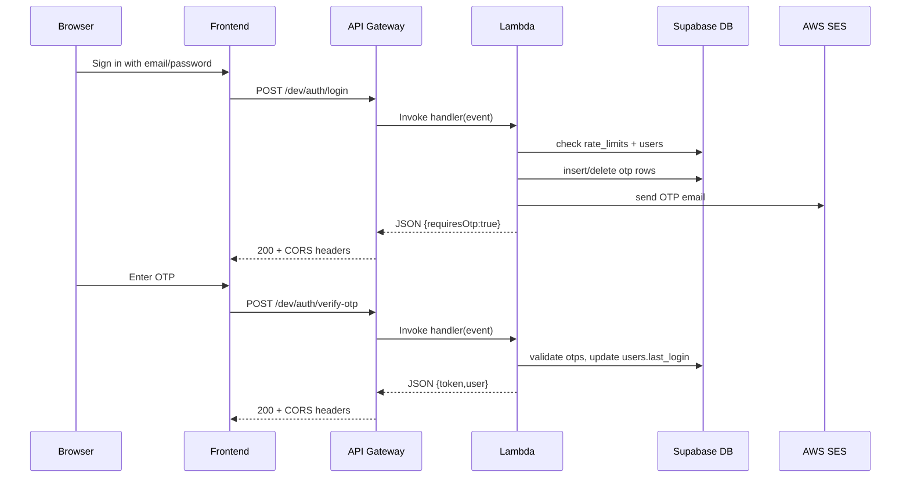

# Lambda Backend

This folder contains the Lambda-backed auth API for the project.

Available routes:
- `/`
- `/auth/google`
- `/auth/google/callback`
- `/auth/signup`
- `/auth/login`
- `/auth/resend-otp`
- `/auth/forgot-password`
- `/auth/verify-otp`

Local usage:
- `npm run dev` starts the Lambda-compatible dev server on `LAMBDA_PORT` or `5001`

## High-Level Architecture

```mermaid
flowchart LR
  U[User Browser] --> F[Frontend App<br/>Amplify Hosting]
  F -->|HTTPS /auth/*| G[API Gateway HTTP API<br/>/dev stage]
  G --> L[Lambda Function<br/>backend/lambda/index.js]

  L --> A[Auth Service<br/>shared/auth-service.js]
  A --> S[(Supabase Postgres)]
  A --> R[RPC: increment_rate_limit(p_key)]
  A --> E[AWS SES<br/>sendEmail OTP]

  S --- T1[users]
  S --- T2[otps]
  S --- T3[rate_limits]
  S --- T4[profiles optional]

  L --> H[HTTP Helpers + CORS<br/>shared/http.js]
  H --> G
  G --> F
  F --> U
```



Recommended next steps:
1. Add runtime secrets in `backend/lambda/.env` or deployment environment variables.
2. Add infrastructure deployment for IAM policies and API Gateway domains.
3. Point `VITE_API_BASE_URL` to the API Gateway URL after deployment.
